<h2>TensorFlow-FlexUNet-Image-Segmentation-Combined-Breast-Cancer-Ultrasound (2026/05/03)</h2>

This is the first experiment of Image Segmentation for Combined Breast Cancer Ultrasound (Benign and Malignant)
 based on 
our <a href="./src/TensorFlowFlexUNet.py">TensorFlowFlexUNet</a>
 (<b>TensorFlow Flexible UNet Image Segmentation Model for Multiclass</b>) and a 512x512 pixels PNG 
 <a href="https://drive.google.com/file/d/1ldE__nA49tKg8Kqaz_vHIvku34LMzr2O/view?usp=sharing">
Augmented-Combined-Breast-Cancer-Ultrasound-ImageMask-Dataset.zip</a> with colorized masks (<a href="https://creativecommons.org/publicdomain/zero/1.0/">
CC0: Public Domain</a>), which was derived by us from 
  
<a href="https://www.kaggle.com/datasets/omarsherifrabie/combined-breast-cancer-ultrasound-dataset">
<b>Combined Breast Cancer Ultrasound Dataset</b>
</a>.
  

<b>Actual Image Segmentation for Breast Cancer Ultrasound of 512x512 pixels</b> 
As shown below, the inferred masks look similar to the ground truth masks.  
 
<b>class-color-map = {Benign:green, Malignant: red}</b> 
 
<table>
<tr>
<th>Input: image</th>
<th>Mask (ground_truth)</th>
<th>Prediction: inferred_mask</th>
</tr>
<tr>
<td>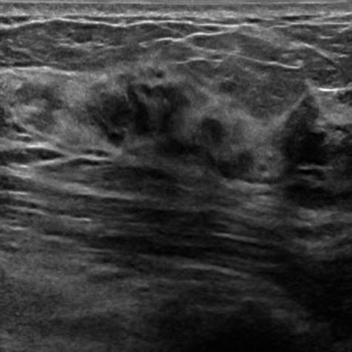</td>
<td>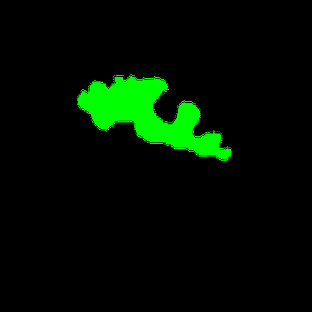</td>
<td>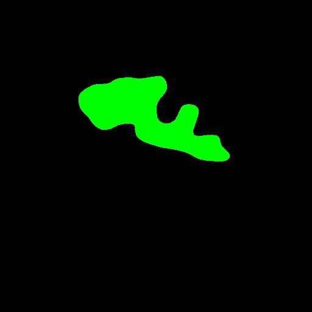</td>
</tr>

<tr>
<td>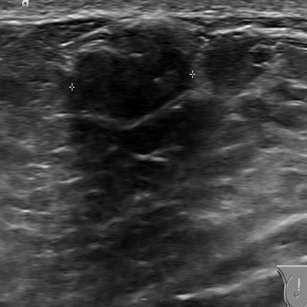</td>
<td></td>
<td></td>
</tr>

<tr>
<td>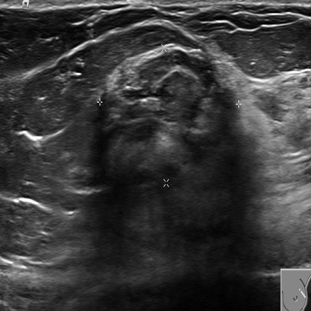</td>
<td></td>
<td></td>
</tr>
</table>

 
<h3>1. Dataset Citation</h3>
The dataset used here has been taken from the following kaggle web site:  
<a href="https://www.kaggle.com/datasets/omarsherifrabie/combined-breast-cancer-ultrasound-dataset">
<b>Combined Breast Cancer Ultrasound Dataset</b>
</a> on the kaggle.com.
  
The following explanation was taken from the above kaggle web site.
  
<b>About Dataset</b> 
We use a merger of two major benchmark datasets for Breast Ultrasound Image Segmentation;   
<a href="https://www.cancerimagingarchive.net/collection/breast-lesions-usg/">
<b>Breast- Lesions-USG dataset from the Cancer Imaging Archive</b></a>, and  
<a href="https://data.mendeley.com/datasets/7fvgj4jsp7/1"><b>BUS-UCLM: Breast ultrasound lesion segmentation dataset</b></a>.  
 The former contains 256 ultrasound grayscale-alpha images, each accompanied with a mask image covering the malignant tumors in addition to a mask image covering benign tumor area in the image. The dataset is imbalanced, since there are only 14 images containing suspicious regions and only 4 images with no tumor at all. The images are formatted as PNG files, stored as RGBA despite the absence of color in the images. The latter dataset contains 683 images, formatted the same as the former. Consisting of 174 benign tumors, 90 malignant tumors, and 419 normal images, combining these two datasets creates a dataset with 939 total images, 423 containing no tumor, 188 containing benign tumors, and 328 containing malignant tumors. In addition to increasing the dataset size, 
this makes the dataset more balanced and diverse, which is a common problem in image segmentation problems.
  
<b>License</b> 
<a href="https://creativecommons.org/publicdomain/zero/1.0/">
CC0: Public Domain
</a>
 
 
<h3>
<a id="2">
2 Combined Breast Cancer Ultrasound ImageMask Dataset
</a>
</h3>
 If you would like to train this Breast-Ultrasound-Images Segmentation model by yourself,
 please download the dataset from the google drive  
 <a href="https://drive.google.com/file/d/1ldE__nA49tKg8Kqaz_vHIvku34LMzr2O/view?usp=sharing">
Augmented-Combined-Breast-Cancer-Ultrasound-ImageMask-Dataset.zip</a> (<a href="https://creativecommons.org/publicdomain/zero/1.0/">
CC0: Public Domain</a>)
, expand the downloaded ImageMaskDataset and put it under <b>./dataset</b> folder to be
 
<pre>
./dataset
└─Combined-Breast-Cancer-Ultrasound
    ├─test
    │   ├─images
    │   └─masks
    ├─train
    │   ├─images
    │   └─masks
    └─valid
        ├─images
        └─masks
</pre>
 
<b>Combined Breast Cancer Ultrasound Statistics</b> 
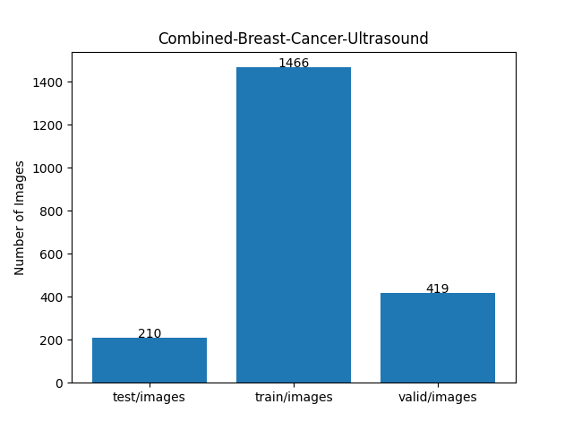 
 
As shown above, the number of images of train and valid datasets is not so large to use for the
 training set of our segmentation model.
 
 
<b>Train_images_sample</b> 
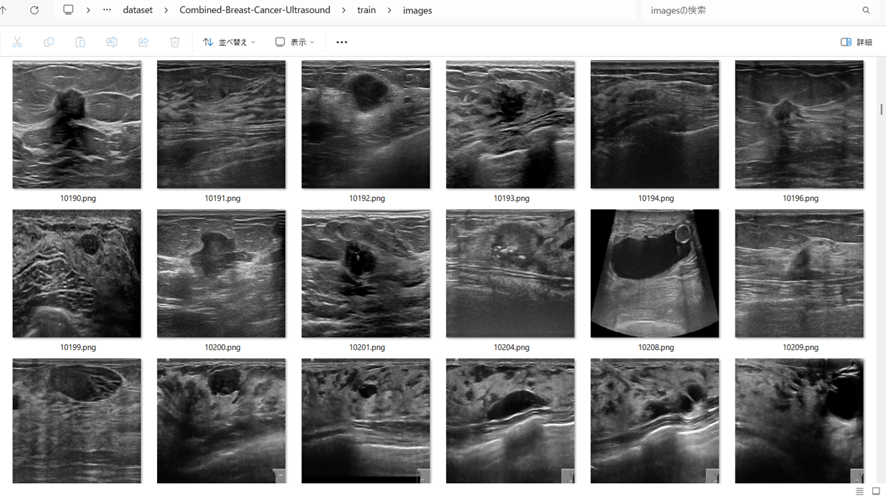
 
<b>Train_masks_sample</b> 
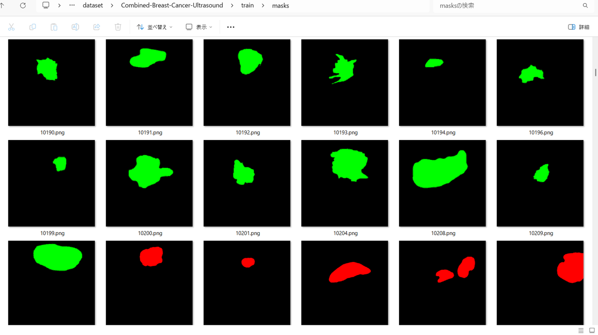
 

<h3>
3 Train TensorFlowFlexUNet Model
</h3>
 We trained Breast-Ultrasound-Images TensorFlowFlexUNet Model by using the following
<a href="./projects/TensorFlowFlexUNet/Combined-Breast-Cancer-Ultrasound/train_eval_infer.config"> <b>train_eval_infer.config</b></a> file.  
Please move to ./projects/TensorFlowFlexUNet/Breast-Ultrasound-Images and run the following bat file. 
<pre>
>1.train.bat
</pre>
, which simply runs the following command. 
<pre>
>python ../../../src/TensorFlowFlexUNetTrainer.py ./train_eval_infer.config
</pre>

<b>Model parameters</b> 
Defined a small <b>base_filters = 16 </b> and large <b>base_kernels = (11,11)</b> for the first Conv Layer of Encoder Block of 
<a href="./src/TensorFlowFlexUNet.py">TensorFlowFlexUNet.py</a> 
and a large <b>num_layers = 8</b> (including a bridge between Encoder and Decoder Blocks).
<pre>
[model]
;You may specify your own UNet class derived from our TensorFlowFlexModel
model         = "TensorFlowFlexUNet"
generator     =  False
image_width    = 512
image_height   = 512
image_channels = 3
num_classes    = 3

base_filters   = 16
base_kernels   = (11,11)
num_layers     = 8
dropout_rate   = 0.04
dilation       = (1,1)
</pre>
<b>Learning rate</b> 
Defined a small learning rate.  
<pre>
[model]
learning_rate  = 0.00007
</pre>
<b>Loss and metrics functions</b> 
Specified "categorical_crossentropy" and <a href="./src/dice_coef_multiclass.py">"dice_coef_multiclass"</a>. 
<pre>
[model]
loss           = "categorical_crossentropy"
metrics        = ["dice_coef_multiclass"]
</pre>
<b>Dataset class</b> 
Specifed <a href="./src/ImageCategorizedMaskDataset.py">ImageCategorizedMaskDataset</a> class. 
<pre>
[dataset]
class_name    = "ImageCategorizedMaskDataset"
</pre>
 
<b>Learning rate reducer callback</b> 
Enabled learing_rate_reducer callback, and a small reducer_patience.
<pre> 
[train]
learning_rate_reducer = True
reducer_factor     = 0.4
reducer_patience   = 4
</pre>
<b>Early stopping callback</b> 
Enabled early stopping callback with patience parameter.
<pre>
[train]
patience      = 10
</pre>

<b>RGB Color map</b> 
Specifed rgb color map dict for Breast-Ultrasound-Images 3 classes. 
<pre>
[mask]
mask_datatype= "categorized"
mask_file_format = ".png"
;Breast-Ultrasound-Images rgb color map dict for 1+2 classes.
;        background:black , Benign:green  Malignant: red
rgb_map = {(0,0,0):0,(0,255,0):1, (255,0,0):2 }
</pre>

<b>Epoch change inference callback</b> 
Enabled <a href="./src/EpochChangeInferencer.py">epoch_change_infer callback</a></b>. 
<pre>
[train]
epoch_change_infer       = True
epoch_change_infer_dir   =  "./epoch_change_infer"
num_infer_images         = 6
</pre>

By using this callback, on every epoch_change, the inference procedure can be called
 for 6 images in <b>mini_test</b> folder. This will help you confirm how the predicted mask changes 
 at each epoch during your training process.  
  
As shown below, early in the model training, the predicted masks from our UNet segmentation model showed 
discouraging results.
 However, as training progressed through the epochs, the predictions gradually improved. 
   
 
<b>Epoch_change_inference output at starting (epoch 1,2,3)</b> 
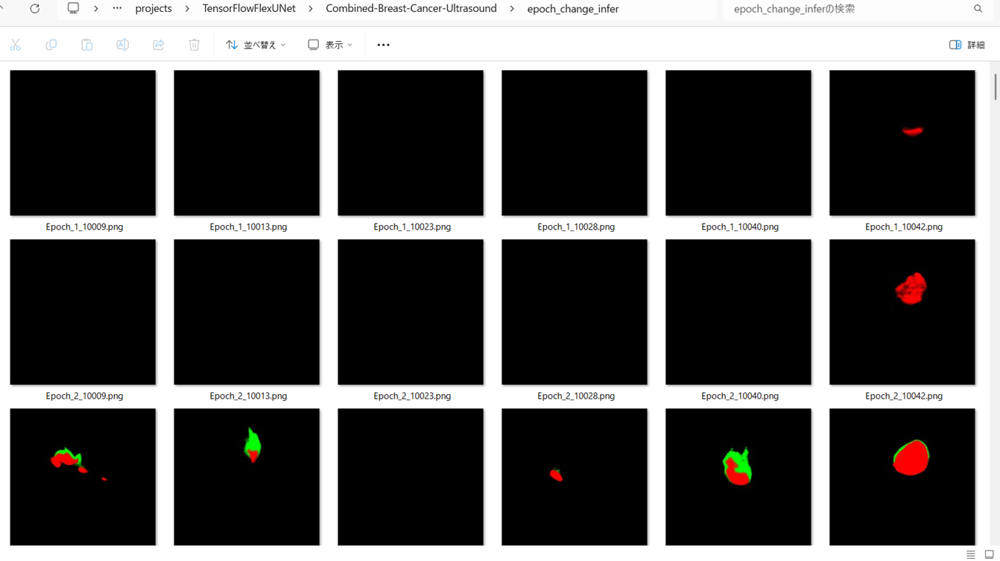 
 
<b>Epoch_change_inference output at middlepoint (epoch 23,24,25)</b> 
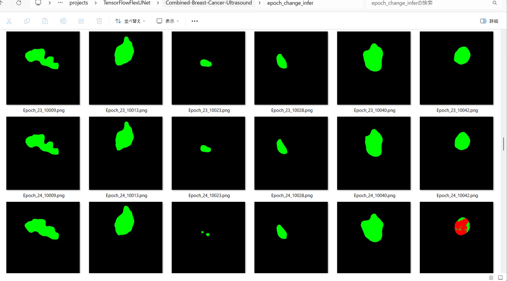 
 

<b>Epoch_change_inference output at ending (epoch 48,49,50)</b> 
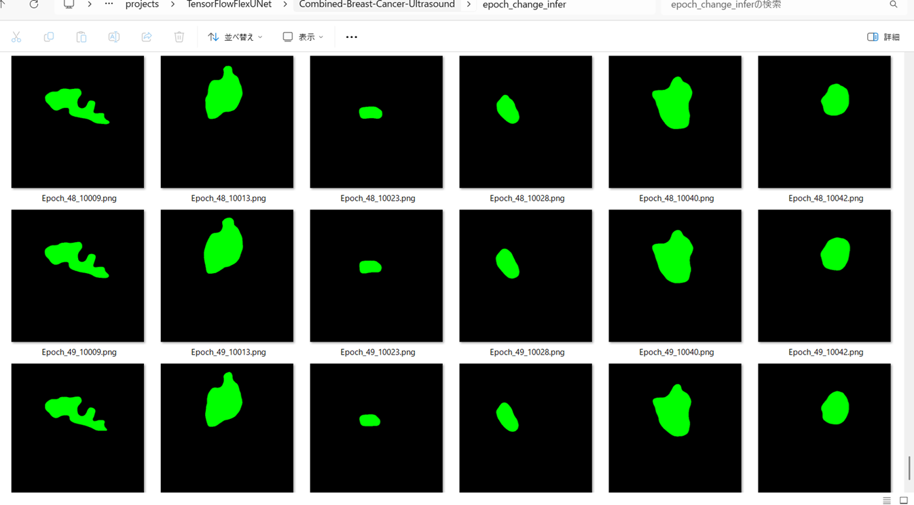 
 

In this experiment, the training process was terminated at epoch 50.  
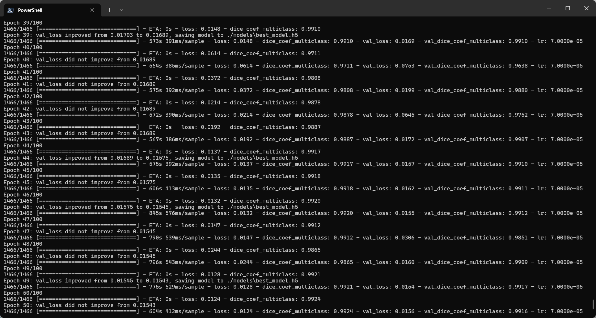 
 

<a href="./projects/TensorFlowFlexUNet/Combined-Breast-Cancer-Ultrasound/eval/train_metrics.csv">train_metrics.csv</a> 
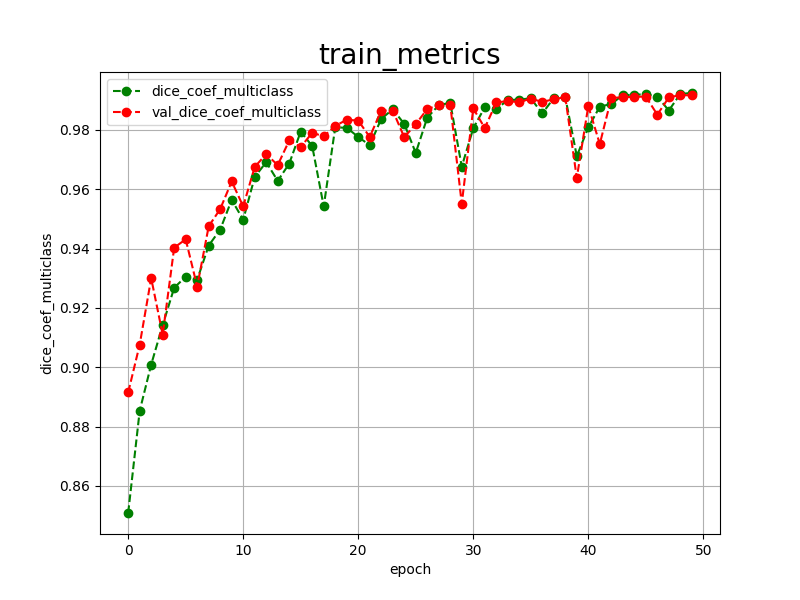 

 
<a href="./projects/TensorFlowFlexUNet/Combined-Breast-Cancer-Ultrasound/eval/train_losses.csv">train_losses.csv</a> 
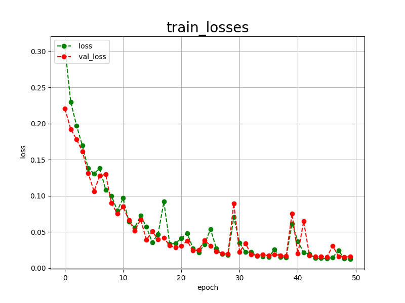 

 

<h3>
4 Evaluation
</h3>
Please move to <b>./projects/TensorFlowFlexUNet/Breast-Ultrasound-Images</b> folder, 
and run the following bat file to evaluate TensorFlowUNet model for Breast-Ultrasound-Images. 
<pre>
./2.evaluate.bat
</pre>
This bat file simply runs the following command.
<pre>
python ../../../src/TensorFlowFlexUNetEvaluator.py ./train_eval_infer_aug.config
</pre>

Evaluation console output: 
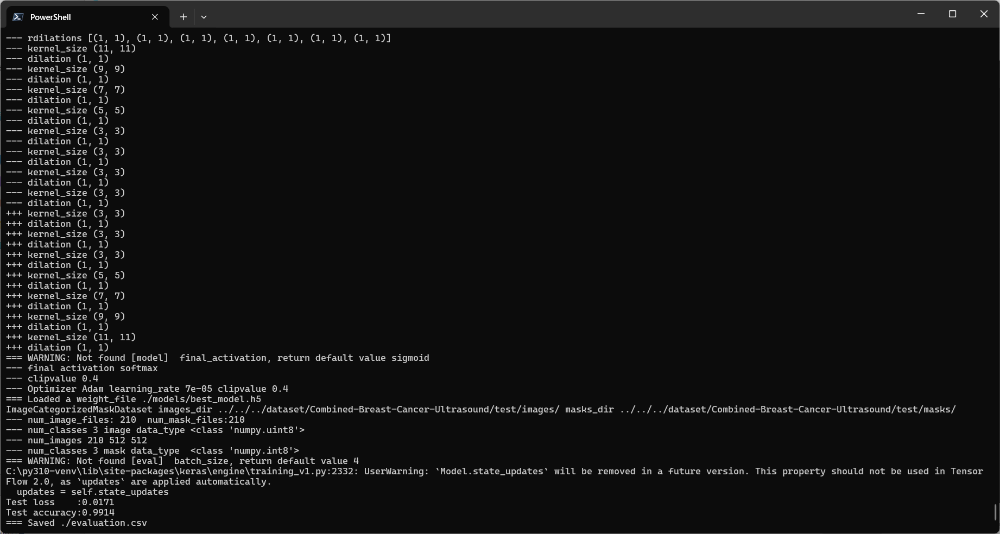
  Image-Segmentation-Breast-Ultrasound-Images

<a href="./projects/TensorFlowFlexUNet/Combined-Breast-Cancer-Ultrasound/evaluation.csv">evaluation.csv</a> 
The loss (categorical_crossentropy) to this Breast-Ultrasound-Images/test was low, and dice_coef_multiclass 
high as shown below.
 
<pre>
categorical_crossentropy,0.0171
dice_coef_multiclass,0.9914
</pre>
 

<h3>
5 Inference
</h3>
Please move to a <b>./projects/TensorFlowFlexUNet/Breast-Ultrasound-Images</b> folder 
,and run the following bat file to infer segmentation regions for images by the Trained-TensorFlowUNet model for Breast-Ultrasound-Images. 
<pre>
./3.infer.bat
</pre>
This simply runs the following command.
<pre>
python ../../../src/TensorFlowFlexUNetInferencer.py ./train_eval_infer_aug.config
</pre>

<b>mini_test_images</b> 
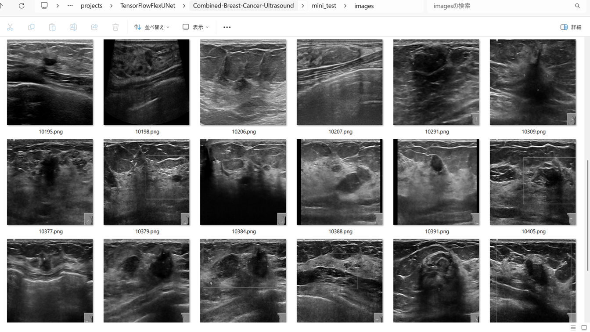 
<b>mini_test_mask(ground_truth)</b> 
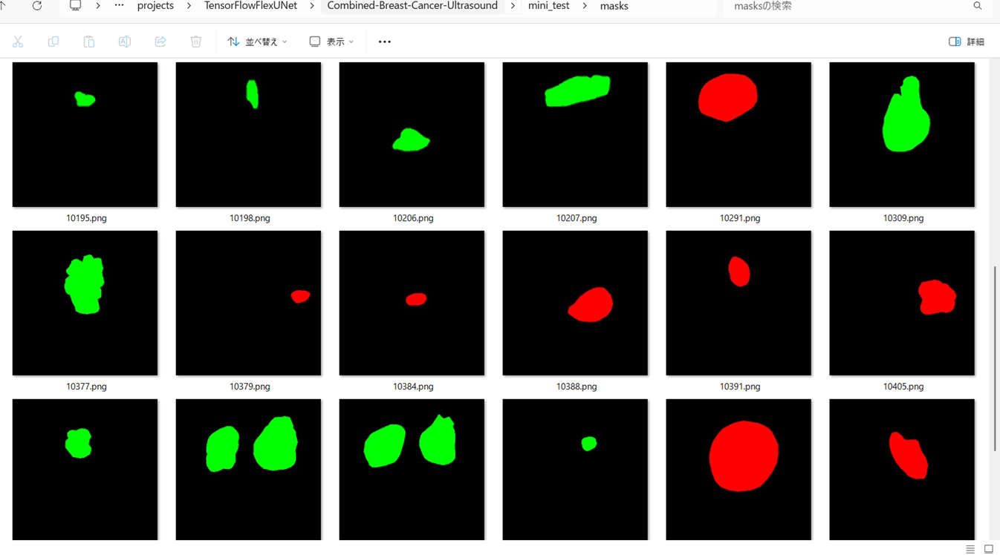 

<b>Inferred test masks</b> 
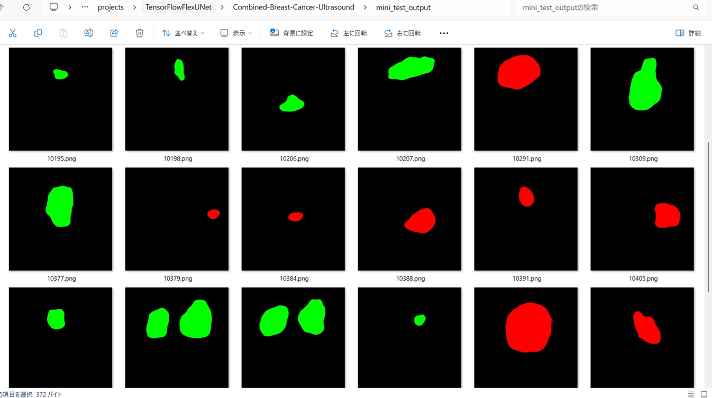 
 

<b>Enlarged images and masks for Breast Cancer Ultrasound of 512x512 pixels</b> 
 
<b>class-color-map = {Benign:green, Malignant: red}</b> 
 
<table>
<tr>
<th>Image</th>
<th>Mask (ground_truth)</th>
<th>Inferred-mask</th>
</tr>
<tr>
<td>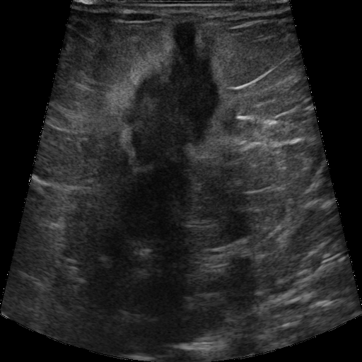</td>
<td></td>
<td>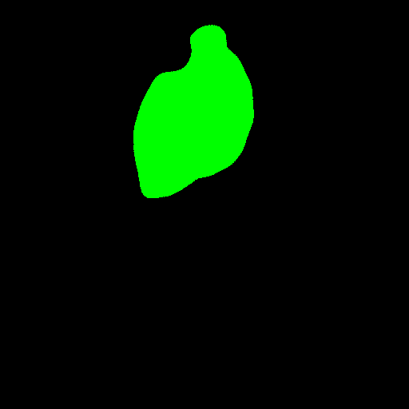</td>
</tr>

<tr>
<td>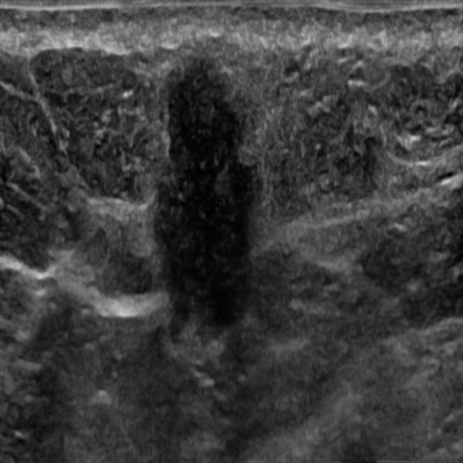</td>
<td>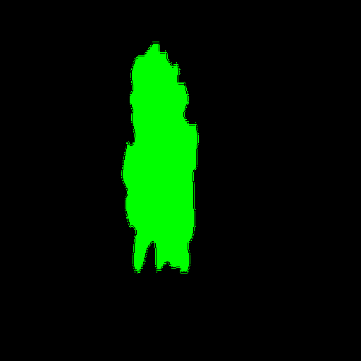</td>
<td>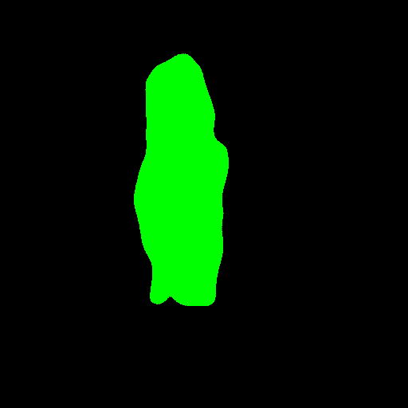</td>
</tr>

<tr>
<td>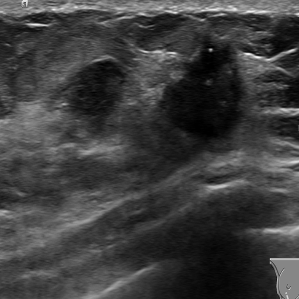</td>
<td>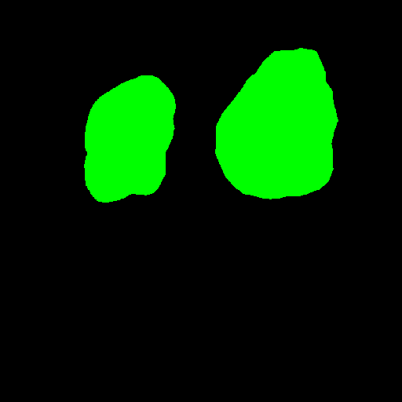</td>
<td>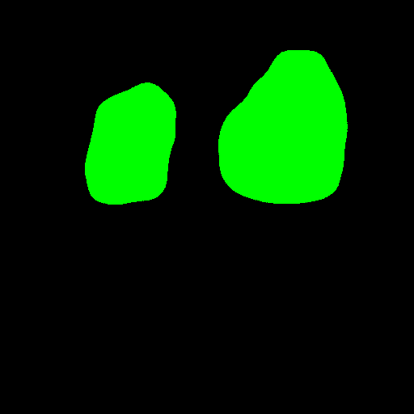</td>
</tr>

<tr>
<td></td>
<td></td>
<td></td>
</tr>

<tr>
<td>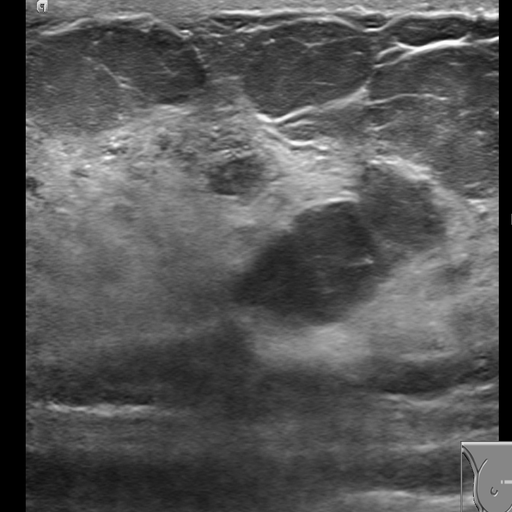</td>
<td></td>
<td></td>
</tr>

<tr>
<td>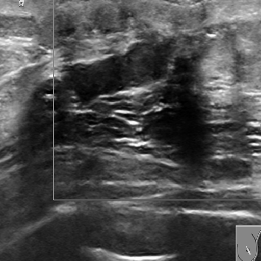</td>
<td></td>
<td></td>
</tr>
</table>

 
<h3>
References
</h3>
<b>1. Breast Ultrasound Images Dataset</b> 
<a href="https://www.kaggle.com/datasets/aryashah2k/breast-ultrasound-images-dataset">
https://www.kaggle.com/datasets/aryashah2k/breast-ultrasound-images-dataset
</a>
 
 
<b>2. Breast lesion detection using an anchor-free network from ultrasound images with segmentation-based enhancement</b> 
Yu Wang & Yudong Yao 
<a href="https://www.nature.com/articles/s41598-022-18747-y">
https://www.nature.com/articles/s41598-022-18747-y
</a>
 
 
<b>3. Classification of Breast Cancer Ultrasound Images with Deep Learning-Based Models </b> 
Fatih Uysa,and Mehmet Murat Köse 
<a href="https://www.mdpi.com/2673-4591/31/1/8/html">
https://www.mdpi.com/2673-4591/31/1/8/html
</a>
 
 
<b>4. A CNN Deep Learning Technique for Prediction of Breast Cancer using Ultrasound Image
</b> 
Atisham Khan and Silky Pareyani 
<a href="https://www.jetir.org/papers/JETIR2303813.pdf">
https://www.jetir.org/papers/JETIR2303813.pdf
</a>
 
 
<b>5. Discrimination of Breast Cancer Based on Ultrasound Images and Convolutional Neural Network
</b> 
Rui Du,Yanwei Chen,Tao Li, Liang Shi,Zhengdong Fei,and Yuefeng Li
 
<a href="https://www.hindawi.com/journals/jo/2022/7733583/">
https://www.hindawi.com/journals/jo/2022/7733583/
</a>
 
 
<b>6. TensorFlow-FlexUNet-Image-Segmentation-BUS-BRA</b> 
Toshiyuki Arai 
<a href="https://github.com/sarah-antillia/TensorFlow-FlexUNet-Image-Segmentation-BUS-BRA">
https://github.com/sarah-antillia/TensorFlow-FlexUNet-Image-Segmentation-BUS-BRA</a>
 
 
<b>7. TensorFlow-FlexUNet-Image-Segmentation-BUS-UC</b> 
Toshiyuki Arai 
<a href="https://github.com/sarah-antillia/TensorFlow-FlexUNet-Image-Segmentation-BUS-UC">
https://github.com/sarah-antillia/TensorFlow-FlexUNet-Image-Segmentation-BUS-UC</a>
 
 
<b>8. TensorFlow-FlexUNet-Image-Segmentation-BUS-UCLM</b> 
Toshiyuki Arai 
<a href="https://github.com/sarah-antillia/TensorFlow-FlexUNet-Image-Segmentation-BUS-UCLM">
https://github.com/sarah-antillia/TensorFlow-FlexUNet-Image-Segmentation-BUS-UCLM
</a>
  
<b>9. TensorFlow-FlexUNet-Image-Segmentation-BUSI-WHU-Breast-Cancer</b> 
Toshiyuki Arai 
<a href="https://github.com/sarah-antillia/TensorFlow-FlexUNet-Image-Segmentation-BUSI-WHU-Breast-Cancer">
https://github.com/sarah-antillia/TensorFlow-FlexUNet-Image-Segmentation-BUSI-WHU-Breast-Cancer
</a>
  
